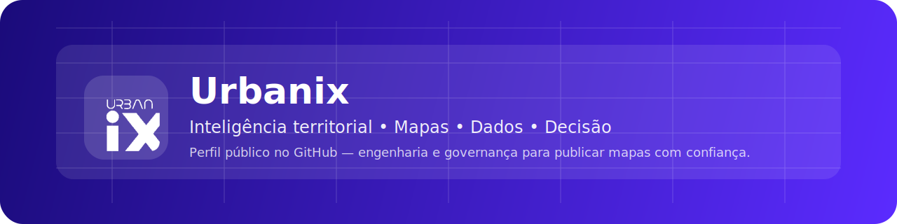

  

  <strong>Inteligência territorial para transformar dados em decisão.</strong> 
  Plataforma de mapas (WebGIS) + integração de dados + análises e recomendações para apoiar governos e empresas.

  <!-- Substitua os links abaixo pelos oficiais -->
  <a href="https://www.linkedin.com/company/group-urbanix">LinkedIn</a> •
  <a href="https://www.instagram.com/urbanixgroup/">Site</a> •
  <a href="mailto:atendimento@urbanixgroup.com.br">Contato</a>

---

## Quem somos

A Urbanix Group atua com inteligência e desenvolvimento territorial, combinando tecnologia, geoprocessamento e análise aplicada para apoiar decisões estratégicas — do planejamento à implantação.

## O que entregamos (visão rápida)

- **Plataforma de Inteligência para Cidades**: integra dados urbanos, econômicos, demográficos e de educação; trabalha com **grade territorial** para leitura por bairro/quadra; gera painéis executivos.
- **Mapas e análises por tema**: dinâmica econômica (CNPJ/atividades), educação (escolas e evolução de matrículas), planejamento urbano (densidade, perfis e cenários).
- **Relatórios e recomendações**: além do mapa, entregamos sínteses executivas e orientação prática de tomada de decisão.

## Metodologia (transformando localização em estratégia)

1. **Localização** (zona de influência)
2. **Isócronas** (acessibilidade e alcance)
3. **Perfil** (dados sociodemográficos)
4. **Mapeamento e déficits** (oportunidades e lacunas)
5. **Síntese e recomendação estratégica**

## Áreas de aplicação

- **Setor público**: educação, desenvolvimento econômico, planejamento urbano.
- **Setor privado**: real estate, indústria, logística, expansão comercial.

## Repositórios em destaque

> Se você estiver começando, pinne 4–6 repositórios públicos aqui (Overview → *Pinned*).  
> Sugestão: um repositório “landing” (docs públicos), um “template”, e 2–4 projetos técnicos (quando puderem ser públicos).

- `urbanix-repo-template` — padrão de engenharia e governança (issues, PRs, CODEOWNERS, etc.).
- `urbanix-mapas-docs` — documentação (quando sanitizada para uso público).
- `urbanix-mapas-platform` — pipeline (PostGIS + tiles + API) (quando aplicável para público).
- `urbanix-mapbot` — automação e inspeção de mapas (quando aplicável para público).

## Reconhecimento e conformidade

A Urbanix foi aprovada em chamada pública vinculada à Invest Paraná / InovaInvest.  
Para uso de marcas e menções, mantemos um aviso de conformidade em `LEGAL-NOTICE.md` (neste repositório `.github`).

## Contato

- **Telefone**: +55 (43) 99641-4009  
- **Localidade**: Londrina • PR

---

